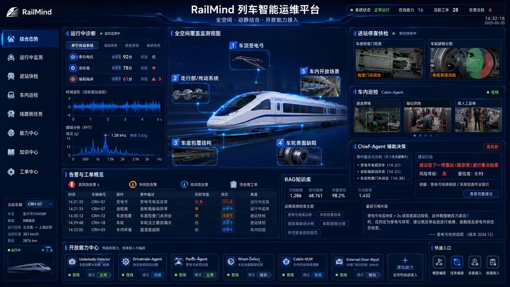

# RVID 2026 国际列车设计大赛 · 参赛要点

> 整理日期：2026-09-04
>
> 官网：<https://rvid.csrcqsf.com/match_2026_cn.html#awards>

## 1. 大赛概况

- **全称**：2026 国际列车设计大赛，主题"智绘列车 · 共筑未来"。
- **主办方**（7 家）：港铁公司、中国铁道学会、中国中车、高速磁浮运载技术全国重点实验室、国家高速动车组总成工程技术研究中心、中车青岛四方国家级工业设计中心、中泰轨道交通"一带一路"联合实验室。
- **支持单位**：香港设计师协会（HKDA）、香港设计中心、国际轨道车辆工业设计联盟。
- **总奖金**：约 90 万元人民币；入围者赴中国香港现场答辩（组织方承担每队 1 名成员差旅住宿）。
- **其他激励**：获奖作品官网及十余家合作媒体宣传；优秀作品有机会纳入**中国中车产品研发储备库**。
- **联系方式**：RVID_CRRC@163.com；0086-532-68953558。

## 2. 关键时间（报名已完成 ✅ 2026-09-04 确认）

| 节点 | 日期 |
| --- | --- |
| 建议报名注册 | 2026-07-30 之前（**已过，需立即确认报名通道状态**） |
| 征集截止 | **2026-09-30** |
| 初评 | 2026-10-09 |
| 初评公布 | 2026-10-12 |
| 终评 | 2026-11-03 |
| 颁奖 | 2026-11-04 |

## 3. 赛道设置

作品须围绕五大方向中的一项或多项：**可持续性、乘客体验、包容、智能、效率**。

"智能"方向包含：故障预测与健康管理（PHM）、AI 技术应用、自动化与机器人技术、预测性检修维护、数据融合解决方案、人机协作系统。

### 赛道一：车辆工业设计（33 项奖，45 万）

| 奖项 | 名额 | 奖金 |
| --- | --- | --- |
| 金奖 | 2 | 50,000 元 |
| 银奖 | 3 | 30,000 元 |
| 铜奖 | 8 | 20,000 元 |
| 新锐奖 | 20 | 5,000 元 |

要求：海报（A2 竖版 594×420mm，jpg，RGB，300dpi）、**必须提交三维软件建模生成的三维模型**、文字说明 ≤1000 字、效果图/视频等。

### 赛道二：智能化解决方案（RailMind 对口，23 项奖，45 万）

| 奖项 | 名额 | 奖金 |
| --- | --- | --- |
| 金奖 | 2 | 50,000 元 |
| 银奖 | 3 | 30,000 元 |
| 铜奖 | 8 | 20,000 元 |
| 优秀奖 | 10 | 10,000 元 |

**评审标准**：技术创新性、实用性、落地可行性、对轨道交通领域的价值贡献。

## 4. 参赛材料（赛道二）

### 4.1 设计方案报告（必选）

- PDF，**中英双语**，≤40 页（含附录）；
- 内容须涵盖：问题分析、系统架构设计、算法模型描述、**模拟测试结果**、工程可行性分析、实施路径、预期效益评估。

### 4.2 方案介绍海报（必选）

- A2 竖版 594mm×420mm，JPG，RGB，300dpi；
- 须含：参赛单位（学校）、队伍名称、作品名称、核心技术、创新亮点、应用场景及应用效果。

### 4.3 答辩演示文稿（必选）

- PPT，中英双语，答辩 ≤5 分钟；
- 视频片段累计 ≤2 分钟；
- 须涵盖：方案背景与目标、核心技术与方案设计、创新点与优势、性能验证（仿真/实验数据）、应用价值与落地可行性、团队介绍。

### 4.4 方案实物（可选，建议必做）

- 可运行演示程序、**GitHub 开源仓库链接（官方推荐）**、仿真模型、运行环境说明、测试数据集等。

### 4.5 通用要求

- 必须提交**签字盖章的参赛作品知识产权声明**扫描件，否则参赛无效；
- 作品以 .zip/.rar 发送至 RVID_CRRC@163.com，文件名与邮件主题均为"赛道名称+团队（个人）名称+作品名称"；
- 视频 .mp4 且不低于 1080p；JPG 总量 ≤50M，视频 ≤150M；
- 说明文字须英文或**中英双语**（方便国际评委）；
- 每人可提交多件作品；作品不退还，需自留备份。

## 5. RailMind 对口分析与差距清单

### 对口性

RailMind（全空间、动静结合的列车智能运维智能体平台）直接命中"智能"方向的 PHM、AI 应用、预测性检修维护、数据融合等条目；平台定位（多源诊断 + Agent 编排 + RAG + 工单闭环）在"落地可行性"和"价值贡献"上有天然叙事优势。

### UI 效果图

综合态势大屏效果图已保存：`assets/railmind-dashboard-mockup.jpg`

效果图要点（可用于后续报告/海报/PPT 素材）：

- 顶栏：系统状态、在线能力 16、活跃工单 28、告警总数 6；
- 左侧导航：综合态势、运行中监测、进站快检、车内巡检、线路侧任务、能力中心、知识中心、工单中心；
- 运行中诊断：牵引电机 92 分/齿轮箱 78 分/轴箱轴承 61 分（风险高），时域波形 + FFT 频域分析（1.28 kHz 峰值 0.42g）；
- 全空间覆盖监测视图：①车顶受电弓 ②走行部/传动系统 ③车底包覆结构 ④车轮表面缺陷 ⑤车内开放场景；
- 进站停靠快检：车底检查门检测（检查门未闭合）、车轮缺陷分割（车轮剥落风险）；
- 车内巡检 Cabin-Agent：通道拥堵、疑似倒地、需人工复核；
- Chief-Agent 辅助决策：高风险、置信度 0.93，"建议在下一停靠站（南京南）进行重点检查"，依据《受电弓检修规程》《车底检查作业指引》；
- 告警与工单概览：受电弓电弧异常（高/待处置）、齿轮箱振动异常（中/分析中）、车底检查门未闭合（中/待复核）、车轮法兰磨耗偏大（低/观察中）、车内温湿度超限（低/观察中）；
- RAG 知识库：文档 1,086、知识块 48,761、向量索引 98.2%、今日检索 1,432；
- 开放能力中心：Underbody-Detector（主用）、Drivetrain-Agent（观察）、Panto-Agent（主用）、Wheel-Defect（辅助）、Cabin-VLM（观察）、External-Door-Mock（辅助）、"+ 添加能力（支持热插拔接入）"；
- 左下车辆信息：CRH-07，复兴号 CR400BF，8 辆编组，北京南→上海虹桥，301 km/h，里程 2876 km。

> 注意：效果图为设计稿，其中数值（如知识库文档数、在线能力 16 个）为示意，开发落地时以实际演示数据为准，避免答辩时与演示不一致。

### 待办差距清单（截止 2026-09-30）

- [x] 报名注册：**已完成**（2026-09-04 确认）；
- [ ] 参赛报告：由《开发方案 V1.0》压缩改写为 ≤40 页中英双语 PDF，补充模拟测试结果与效益评估；
- [ ] A2 竖版海报（JPG，RGB，300dpi，含单位/队伍/作品名称）；
- [ ] 答辩 PPT（中英双语，≤5 分钟，视频片段 ≤2 分钟）；
- [ ] 演示视频（≥1080p，≤150M，可截取端到端演示链路）；
- [ ] 方案实物整理：可运行 Docker 演示 + GitHub 仓库 + 测试数据集；
- [ ] 知识产权声明模板下载、签字盖章扫描；
- [ ] 打包命名："智能化解决方案+团队名称+railmind 作品名称"，发 RVID_CRRC@163.com。

### 时间倒排建议

1. **9 月上旬**：报名已完成；冻结报告大纲；按第 12 节实施路线优先保"能跑通的端到端演示"（演示实物权重高）；
2. **9 月中旬**：完成报告中文稿 → 英文翻译；制作 PPT；整理仓库 README 与数据集；
3. **9 月下旬**：海报设计与打印扫描；演示视频录制；知识产权声明盖章；
4. **9/29 前**：打包提交（预留邮箱传输与确认时间）。
