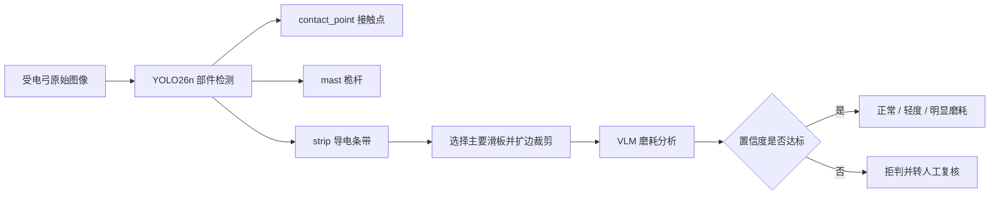
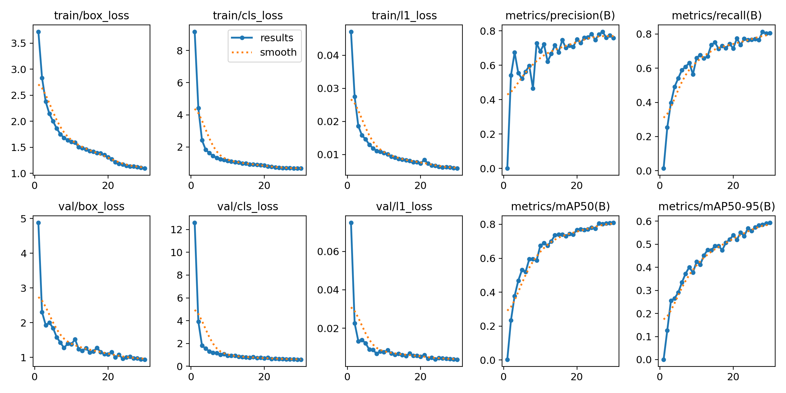
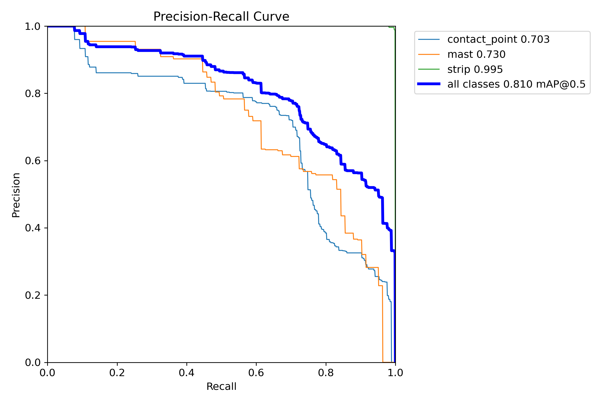
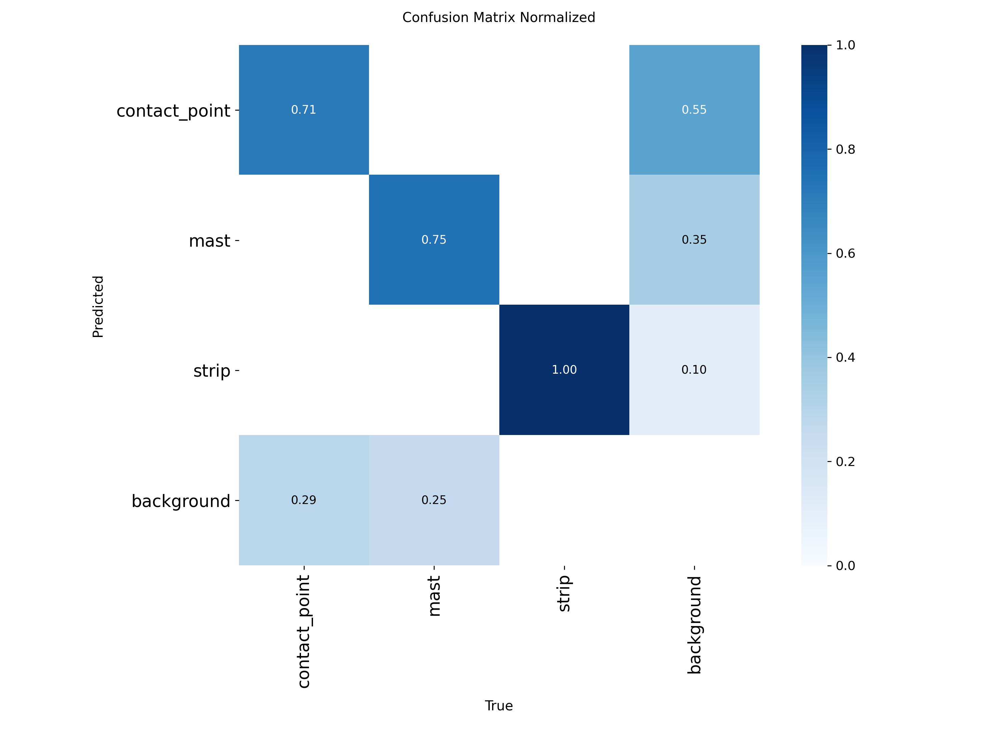
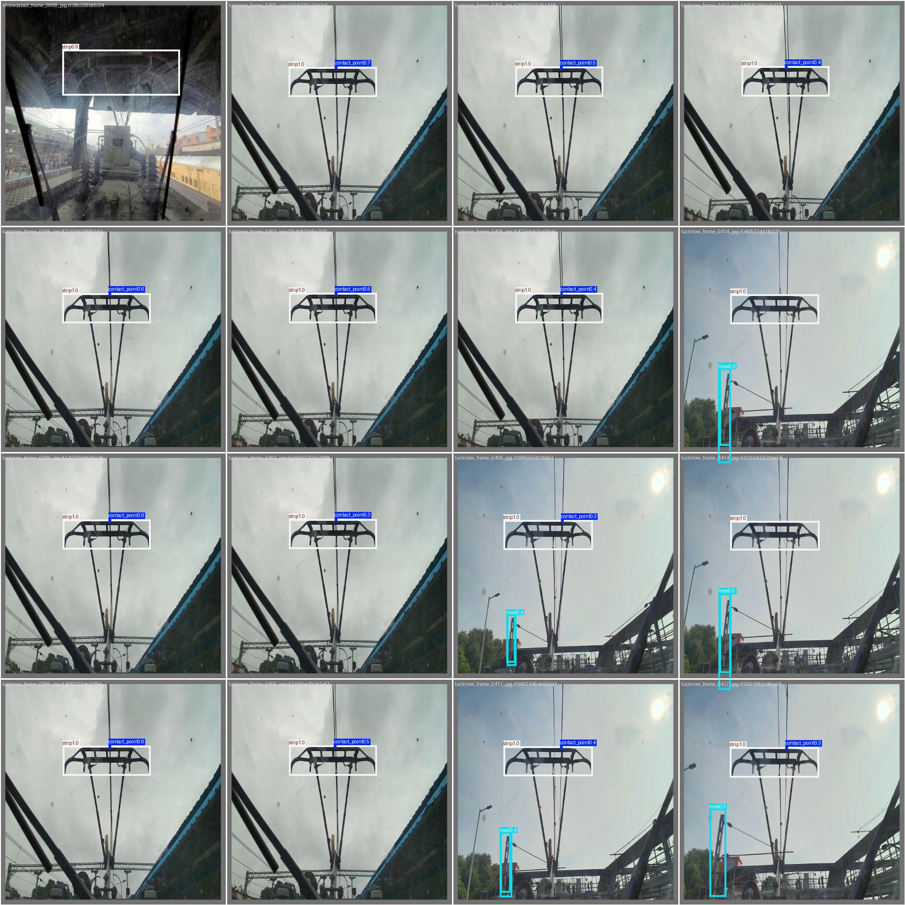

# 受电弓部件目标检测，训练与优化全流程报告

## 摘要

受电弓滑板磨耗分析首先需要回答一个基础问题：图像中哪些区域属于受电弓，滑板在哪里，弓网接触位置又在哪里。若直接把整张轨旁图像交给视觉大模型，站台、接触网、车顶设备和天空都会成为干扰项，滑板在画面中所占比例又很小，容易导致模型看错对象或因细节不足拒绝判断。为此，RailMind 训练了一套三类别受电弓部件检测模型，在磨耗分析之前定位接触点、桅杆和导电条带，并优先裁剪滑板区域供后续模型分析。

训练采用 2,676 张 `640x640` 图像，划分为 2,275 张训练图、265 张验证图和 136 张测试图。归档训练运行 30 个 epoch，最终一轮在验证集上取得 Precision 0.758、Recall 0.805、mAP50 0.810 和 mAP50-95 0.593。分类别 PR 曲线显示，核心目标 `strip` 的 AP50 达到 0.995，而 `contact_point` 和 `mast` 分别为 0.703 和 0.730。这个结果说明模型已经非常擅长定位滑板，但接触点和桅杆仍受小目标、样本不平衡与复杂背景影响。

在工程侧，原代码虽然具备检测能力，却因默认权重路径错误而可能长期处于静默降级状态；同时只暴露了滑板检测接口，没有完整体现三类别模型的能力。本次优化仅针对部件检测层：修正权重解析，补充三类检测接口和模型状态接口，并强化输入检查与滑板裁剪策略。专项测试全部通过，部署权重可正常加载；对三张真实测试图执行推理时分别检出 3、2、2 个目标，覆盖滑板、接触点和桅杆。本次提交不修改磨耗分析、前端或扣件检测代码。

## 1. 功能定位：检测不是最终结论，而是视觉分析入口

受电弓部件检测的价值不在于单独画出几个检测框，而在于为后续诊断提供可信的空间锚点。RailMind 当前将它放在磨耗评估链路的前端：YOLO 模型负责“找对部件”，视觉大模型负责“理解部件状态”，确定性规则负责“把结论映射到风险等级”。



这一分工解决了两个问题。第一，检测模型只需要学习有限且明确的部件类别，输出具有确定的坐标和置信度；第二，VLM 不再面对大量无关背景，而是在滑板局部区域内观察裂纹、缺块和磨耗面。即使检测层不可用，系统仍可退回整图分析，但必须留下降级标记，避免使用者误以为完整链路已经执行。

当前模型识别三类目标：

| 类别 | 类别编号 | 在诊断链路中的作用 |
| --- | ---: | --- |
| `contact_point` | 0 | 表示弓网接触区域，可作为接触状态和异常电弧分析的空间参照 |
| `mast` | 1 | 表示受电弓支撑结构，有助于确认画面中的目标确为完整受电弓结构 |
| `strip` | 2 | 表示导电条带/碳滑板，是当前磨耗评估最关键的裁剪目标 |

## 2. 数据基础：数量足够启动训练，难点集中在小目标和类别差异

### 2.1 来源与划分

数据来自 Roboflow Universe 的 `pantograph-9bhnb/pantograph-qxcoc` 第 6 版，许可为 CC BY 4.0。项目中的本地副本位于：

```text
数据与文档/新建文件夹/数据集与数据/09-受电弓部件检测
```

数据采用标准 YOLO 边界框格式，每行由类别编号和归一化后的中心点、宽、高组成：

```text
class_id center_x center_y width height
```

| 划分 | 图像数 | 用途 |
| --- | ---: | --- |
| 训练集 | 2,275 | 模型参数学习与数据增强 |
| 验证集 | 265 | 每轮训练后的指标计算与模型选择 |
| 测试集 | 136 | 独立样本上的最终检查 |
| 合计 | 2,676 | 全部为 `640x640` 图像 |

统一分辨率使训练不需要额外处理长宽比例，但也带来一个限制：接触点在部分图像中只占极少像素，缩放到 640 后可利用的纹理信息有限。

### 2.2 类别分布及其影响

训练集共有约 5,203 个标注实例。`contact_point` 和 `strip` 数量接近，而 `mast` 明显偏少：

| 类别 | 训练实例 | 验证实例 | 测试实例 | 训练占比 |
| --- | ---: | ---: | ---: | ---: |
| `contact_point` | 2,257 | 258 | 134 | 43.4% |
| `mast` | 670 | 83 | 42 | 12.9% |
| `strip` | 2,276 | 265 | 136 | 43.7% |

这个分布与实际画面有关：滑板和接触点在多数正面受电弓图像中都会出现，而桅杆可能被车顶结构遮挡，也可能因为取景范围不足而不完整。模型因此更容易学到滑板稳定的横向轮廓，而桅杆的形态和位置分布更分散。

数据中没有占据画面大部分区域的目标，以小目标和中等目标为主。最小标注面积约为整图的 `0.01%`。这种数据特征决定了模型的主要难点并非“是否看见受电弓”，而是能否在接触网、横梁和站台设施等线性背景中准确分离接触点及支撑结构。

### 2.3 数据风险

数据规模足以完成工程原型训练，但仍存在三项需要在后续实验中控制的风险。

首先，类别分布不均衡会让总体 mAP 掩盖 `mast` 的短板。其次，数据来自有限的公开场景，不同线路车型、摄像机位置、夜间照明和恶劣天气可能产生明显域偏移。最后，当前标注是矩形框，适合定位但不能精确描述细长滑板的轮廓；如果后续要测量剩余厚度或磨耗宽度，还需要更高分辨率图像或分割标注。

## 3. 训练设计：以可部署性为约束，而非单纯追求最高分数

训练入口位于 `scripts/train_yolo26.py`。脚本会先把 Roboflow 配置中的相对路径改写为绝对路径，生成 `data_fixed.yaml`。这个步骤看似简单，却是保证训练可复现的必要条件，否则从不同工作目录启动时，Ultralytics 可能把 `../train/images` 解析到错误位置。

模型选用 YOLO26n，输入尺寸为 640，batch size 为 16，训练 30 个 epoch。`n` 级模型不是精度最高的选择，但体积和计算量较小，符合平台实时演示、单机运行以及未来边缘端部署的目标。训练脚本会优先尝试 `yolo26n.pt`，下载失败时回退到 `yolo26n.yaml`。归档的 `args.yaml` 显示本次训练记录使用的是 `yolo26n.yaml`，因此报告不把预训练收益算入现有结果。

### 3.1 关键参数

| 参数组 | 配置 | 设计考虑 |
| --- | --- | --- |
| 训练规模 | 30 epochs，batch 16 | 先建立可工作的短训基线，控制训练时间 |
| 图像尺寸 | 640 | 与数据集导出尺寸一致，避免二次缩放 |
| 计算设备 | GPU 0，workers 4 | 单卡训练，兼顾数据加载稳定性 |
| 优化策略 | Auto optimizer，AMP | 由框架选择优化器，混合精度降低显存占用 |
| 可复现设置 | seed 0，deterministic | 降低重复训练的随机差异 |
| 损失权重 | box 7.5，cls 0.5，DFL 1.5 | 强调边界框定位，适应小目标与细长目标 |
| 学习率 | lr0 0.01，lrf 0.01 | 配合 3 个 warmup epoch 平滑进入训练 |
| 停止条件 | patience 50 | 30 轮训练中不会提前停止，完整观察收敛趋势 |

### 3.2 数据增强

训练启用了 HSV 色彩扰动、平移、缩放、水平翻转、Mosaic 和随机擦除。它们分别模拟光照变化、取景偏移、目标尺度变化和局部遮挡。Mosaic 在最后 10 个 epoch 关闭，使模型后期更多地适应真实单图分布。

没有启用垂直翻转是合理的，因为倒置受电弓不符合实际场景；没有启用明显旋转和透视变换则较为保守。考虑到线路坡度、摄像机安装角和车体姿态差异，后续可以增加小角度旋转与轻量透视增强，但需要避免生成不符合机械结构的样本。

## 4. 训练结果：整体收敛良好，类别表现差异明显

训练产物位于：

```text
数据与文档/新建文件夹/数据集与数据/13-训练结果与评估产物/panto_y26n
```

该目录保留了权重、逐轮指标、训练曲线、混淆矩阵、PR 曲线和验证集预测图，足以回溯本次训练过程。

### 4.1 收敛曲线



图中前三列分别展示框回归、分类和 L1 损失。训练损失与验证损失均从前几轮快速下降，随后逐渐平缓，二者没有出现明显背离，说明当前 30 轮内没有强烈的过拟合信号。Precision 和 Recall 在早期波动较明显，从约第 10 轮开始趋于稳定；mAP50 与 mAP50-95 一直保持上升，说明模型在训练结束时仍有继续优化的空间。

训练首轮几乎没有形成有效检测能力，mAP50 仅为 0.00285；到第 30 轮，Precision 达到 0.758，Recall 达到 0.805。Recall 高于 Precision，意味着模型倾向于尽量找全目标，但会承担一定误检代价。对于安全巡检系统，这种倾向通常比大量漏检更容易接受，因为误检可以进入后续规则或人工复核，而漏检可能直接遗漏风险。不过，若前端要持续显示检测框，过多误检会降低用户信任，因此仍需按类别调节阈值。

| 指标 | 第 1 轮 | 第 30 轮 | 变化 |
| --- | ---: | ---: | ---: |
| Precision | 0.00016 | 0.75848 | +0.75832 |
| Recall | 0.01384 | 0.80521 | +0.79137 |
| mAP50 | 0.00285 | 0.80950 | +0.80665 |
| mAP50-95 | 0.00043 | 0.59348 | +0.59305 |
| 训练框损失 | 3.72161 | 1.09486 | -2.62675 |
| 验证框损失 | 4.87940 | 0.93713 | -3.94227 |

完整训练用时约 2,208.89 秒，即 36 分 49 秒。

### 4.2 分类别 PR 曲线



PR 曲线比单一总体指标更能说明模型真正擅长什么。`strip` 的 AP50 达到 0.995，曲线几乎贴近图像上边界，说明滑板的横向外形稳定、训练样本充足，模型能够在较宽的置信度范围内兼顾精确率与召回率。

`contact_point` 的 AP50 为 0.703，是三类中最低的一类。接触点尺寸小、容易与接触网线条混合，框的位置稍有偏移就会明显降低 IoU，因此这一结果符合数据难度。`mast` 的 AP50 为 0.730，虽然样本更少，但它通常具有明显的纵向结构；其主要问题不是完全识别不到，而是复杂背景下容易把相似杆状物判为桅杆。

| 类别 | AP50 | 结果解读 |
| --- | ---: | --- |
| `strip` | 0.995 | 已具备稳定的滑板定位能力，适合作为磨耗分析裁剪入口 |
| `mast` | 0.730 | 基本可用，但背景杆件和样本不足仍影响精度 |
| `contact_point` | 0.703 | 小目标定位是当前主要性能瓶颈 |
| 全类别 | 0.810 | 能支撑工程演示，但不等同于线路运营认证 |

### 4.3 混淆矩阵与误差来源



归一化混淆矩阵表明，真实 `strip` 的识别率达到 1.00，`mast` 为 0.75，`contact_point` 为 0.71。值得注意的是，三个部件之间几乎没有明显互相混淆，错误主要发生在“目标与背景”之间。这意味着类别定义本身是清楚的，模型知道滑板、桅杆和接触点彼此不同；当前短板主要是目标是否被发现，以及背景结构是否被误认为目标。

背景误检中，55% 被归为 `contact_point`、35% 被归为 `mast`、10% 被归为 `strip`。这一分布再次证明滑板类别最稳定，而接触点对背景最敏感。下一轮优化应优先增加难负样本，例如只有接触网、横梁、站台灯杆但没有清晰受电弓的画面，而不是简单重复已有正样本。

### 4.4 验证集预测样例



预测样例显示，模型能在不同距离和取景范围下持续框出滑板。在受电弓主体较完整的图像中，接触点也能被定位；桅杆只在部分画面中出现，符合数据分布。图中部分接触点置信度处于 0.3 至 0.7 区间，说明它虽然经常能被发现，但判断稳定性弱于滑板。实际部署时，不宜对所有类别使用完全相同的置信度阈值：滑板可以使用更高阈值保证裁剪质量，接触点则可以保留较低阈值并交由时序或结构规则二次确认。

## 5. 指标与权重的版本问题

项目 README 和数据说明曾记录 mAP50 0.768、mAP50-95 0.539，而本次直接读取归档 `results.csv` 得到的第 30 轮结果为 0.8095 和 0.5935。更重要的是，当前平台部署的 `railmind/capabilities/panto/weights/best.pt` 与归档训练目录中的 `best.pt` 哈希不同。

这不是可以忽略的文档误差。模型指标只对产生该指标的特定权重、数据划分和推理配置有效。若权重文件不同，即使模型结构和文件名相同，也不能把某次训练的 mAP 直接写到另一份部署权重上。

本报告因此采用以下证据边界：

| 结论 | 可以确认的依据 | 当前不能确认的内容 |
| --- | --- | --- |
| 归档训练第 30 轮 mAP50 为 0.8095 | `results.csv` | 该数值是否属于当前部署权重 |
| 当前部署权重能够正常加载 | 实际模型状态检查 | 它对应哪一次完整训练 |
| 部署权重能检出三个类别 | 三张测试图真实推理 | 完整测试集上的正式 mAP |
| 文档曾记录 mAP50 0.768 | README 和数据说明 | 对应权重的准确哈希与训练批次 |

后续应以权重 SHA-256 为主键建立模型卡，把训练参数、代码版本、数据版本和指标绑定在同一记录中。在完成这一步之前，对外材料应分别表述“归档训练指标”和“当前部署推理验证”，避免形成无法审计的性能声明。

## 6. 从训练模型到工程能力：原实现为何没有真正发挥作用

训练完成并不等于功能已经可用。原始代码具备 YOLO 加载和滑板裁剪逻辑，但默认从 `runs/panto_y26n/weights/best.pt` 加载权重。GitHub 优化版没有包含这个训练目录，实际可用权重存放在 `railmind/capabilities/panto/weights/best.pt`。结果是平台 API 可以正常启动，受电弓磨耗能力也能显示在线，但当检测层真正执行时可能找不到权重，随后静默退回整图 VLM 分析。

另一个问题是能力暴露不完整。底层权重训练了三类目标，原代码却只提供 `detect_strip()`，用户无法直接获得完整部件列表。磨耗模块又使用宽泛异常捕获，模型缺失、图片解码失败和推理异常都会得到相同的“退回全图”表现。这种设计保证了演示不中断，却牺牲了可观测性：系统看似正常，实际上可能从未运行目标检测。

## 7. 本次工程优化

### 7.1 让权重解析符合部署现实

新的解析顺序为：显式环境变量优先，其次使用能力目录内的部署权重，最后才尝试训练目录权重。

```text
RAILMIND_PANTO_WEIGHTS
  -> railmind/capabilities/panto/weights/best.pt
  -> runs/panto_y26n/weights/best.pt
```

这个顺序兼顾了三种场景：生产环境可以通过变量指定经过审批的模型；普通项目副本可以直接使用随能力部署的权重；研发环境仍能使用最新训练结果。模型缓存还会记录实际权重路径，当配置切换时自动重新加载，避免服务继续持有旧模型。

### 7.2 从“只裁剪滑板”升级为完整部件检测

新增的 `detect_parts()` 会统一输出三类部件，过滤未知类别，并按置信度排序。标准检测结果包含类别编号、中文类别名、置信度和 `xyxy` 边界框：

```json
{
  "class_id": 2,
  "class_name": "导电条带(strip)",
  "confidence": 0.907,
  "bbox_xyxy": [120.0, 42.0, 366.0, 188.0]
}
```

这一接口使模型不再只是 VLM 内部的隐藏辅助步骤，而具备了进一步封装为独立平台能力的基础。

### 7.3 改善滑板裁剪质量

原代码选择置信度最高的滑板框。优化后使用“有效框面积乘以置信度”作为选择依据，在多个滑板候选中更偏向覆盖完整、同时置信度较高的区域。裁剪前还会纠正反向坐标、限制越界坐标、过滤零面积框，并校验边距比例。这样可以防止模型偶发输出异常坐标时产生空裁剪或负索引。

### 7.4 让模型状态可查询

新增 `detector_status()` 后，调用方可以查询当前模型模式、实际权重路径、文件是否存在以及加载错误，为后续 API 健康检查和证据记录提供统一状态：

```text
mode: yolo
weights_path: railmind/capabilities/panto/weights/best.pt
weights_exists: true
error: null
```

这些状态不会自行生成风险结论，但能让开发者、评委或运维人员确认部件检测模型是否真实加载。磨耗分析等上层能力可以在后续独立接入，不包含在本次提交范围内。

### 7.5 补齐运行依赖和输入防御

项目依赖中增加了 `ultralytics>=8.4.140`。检测入口会拒绝空图像和超出 `(0, 1]` 的置信度阈值，裁剪入口会拒绝超出 `[0, 1]` 的边距比例。与其让错误进入模型内部形成难以理解的堆栈，不如在能力边界给出明确错误码。

## 8. 验证结果：代码测试通过，真实权重能够执行三类检测

新增的 `tests/test_panto_detect.py` 覆盖权重优先级、环境变量覆盖、类别过滤、结果排序、越界框裁剪和非法参数处理。结合项目原有测试，最终结果为：

```text
37 passed
```

单元测试只能证明逻辑符合预期，不能证明真实模型可以加载。因此又使用数据资产目录中的三张测试图执行实际推理。部署权重成功进入 `yolo` 模式，文件存在且没有加载错误。

| 测试图 | 检测结果 | 代表性置信度 |
| --- | --- | --- |
| `Ahmedabad_frame_0584...jpg` | strip、mast、contact_point | 0.873、0.625、0.444 |
| `Ahmedabad_frame_0798...jpg` | strip、contact_point | 0.863、0.564 |
| `frame_0132...jpg` | strip、contact_point | 0.907、0.529 |

这组验证的意义是确认部署链路已经打通：代码能够找到正确权重、Ultralytics 能够加载模型、中文数据路径可以通过字节解码处理，模型也确实输出了三类训练目标。三张样本数量很少，因此它不替代正式测试集评估，也不用于重新声明 mAP。

## 9. 当前能力边界

目前完成的是“可运行的内部检测层”，而不是“前端可独立操作的产品功能”。平台已经能够加载模型、检测三类部件、裁剪滑板、触发 VLM 磨耗分析，并在失败时留下状态；但能力注册中心中仍只有受电弓磨耗评估和电弧分析，没有 `internal.panto.component_detection`。前端也没有原图与带框结果图的对比区域。

因此，现阶段用户只能从磨耗证据中的 `strip_crop` 和 `detector=yolo` 判断检测层参与了分析，无法直观看到接触点、桅杆和滑板框。若要在答辩或演示中突出该模型，需要增加独立能力描述、推理 API、带框证据图、演示事件和前端页面。这属于产品集成工作，不是继续训练模型。

## 10. 下一阶段路线

下一阶段首先应解决模型资产溯源，而不是立即追求更高指标。建议为每份权重建立模型卡，以 SHA-256 为唯一标识，记录数据版本、代码提交、训练参数、最佳 epoch、分类别指标、运行环境和审批状态。完成对应关系后，再决定当前部署权重是否需要替换为归档训练权重。

模型优化应针对图表揭示的问题展开。`strip` AP50 已达到 0.995，继续堆叠同类滑板样本的边际收益有限；更有价值的是补充接触点小目标、桅杆少样本和复杂背景难负样本。可以开展 80 至 100 epoch 训练、可靠预训练权重、类别重采样、小角度旋转、轻量透视以及 960/1280 输入尺寸的对照实验。每次实验应同时记录精度和推理时延，避免获得无法实时部署的模型。

产品集成阶段建议将检测层注册为 `internal.panto.component_detection`，标准输出包括部件列表、分类计数、置信度、边界框、模型版本、权重哈希、推理耗时、降级状态和带框证据图。前端采用“原始图像—检测结果”并排布局，下方展示三类数量与置信度，再明确标记检测结果是否已进入磨耗分析链路。

## 结论

这套受电弓部件检测模型已经完成从数据训练到真实部署推理的基本闭环。归档训练结果表明，模型整体 mAP50 为 0.810，其中滑板检测最成熟，接触点和桅杆仍是主要改进方向。工程优化解决了一个比模型指标更直接的问题：原先正确的权重并不一定会被代码找到，检测失败也不会被用户察觉。修正权重解析、完整暴露三类检测、增强裁剪防御并记录降级状态后，模型才真正成为一项可验证、可追踪的系统能力。

当前最需要推进的工作有两项：一是建立权重与指标的一一对应关系，确保所有性能声明可审计；二是把隐藏在磨耗流程中的检测层产品化，通过独立 API 和前端证据图让功能真正可见。在此基础上，再围绕接触点小目标与复杂背景开展有针对性的再训练，才能形成从算法指标、工程可靠性到演示表达都完整的受电弓视觉检测能力。
