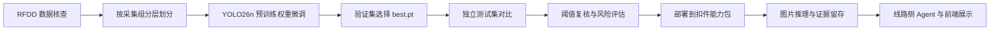

# 高铁钢轨扣件缺陷检测训练与优化全流程报告

> 项目版本：RailMind-GitHub  
> 数据集：Railway Fastener Defect Dataset（RFDD）  
> 检测模型：YOLO26n  
> 报告范围：数据核查、基线训练、问题定位、代码优化、重新训练、独立测试、模型部署与工程验证

## 摘要

本报告记录 RailMind 高铁钢轨扣件缺陷检测从原始训练基线到本轮实际优化部署的完整过程。系统面向线路侧巡检图像，同时识别弹条变形、断裂、缺失、翻转、移位以及正常扣件，并将视觉检测结果交给确定性规则完成风险分级、证据留存和告警展示。

原模型采用 YOLO26n 预训练权重，在 RFDD 数据上训练 30 轮，训练记录中的峰值 mAP50 为 0.97519，峰值 mAP50-95 为 0.79686。但代码复核发现，原数据准备脚本使用“标签文件是否为空”区分正常与缺陷，而 RFDD 的正常扣件本身就是类别 4，同样具有非空标签。原训练、验证清单又没有随训练结果归档，因此旧验证指标虽然真实存在，却无法充分排除划分偏差和同批次数据泄漏。

本轮优化首先修复数据划分，而不是直接更换更大的模型。新流程解析 YOLO 标签中的实际类别，并以文件名前缀中的采集编号为组，使同一编号的左右视角只能进入同一个集合。1,250 张训练候选图像最终划分为 1,062 张训练图和 188 张验证图，原始 100 张测试图保持独立。随后在 RTX 4060 Laptop GPU 上重新训练，设置上限 100 轮、早停耐心值 20，实际完成 84 轮。

优化模型在分组验证集上的综合最优记录为 Precision 0.960、Recall 0.976、mAP50 0.972、mAP50-95 0.802。在完全独立的 100 张测试图上，新模型相较旧模型将 Precision 从 0.915 提高到 0.979、Recall 从 0.897 提高到 0.926、mAP50 从 0.927 提高到 0.960；mAP50-95 从 0.655 降至 0.642，说明新版更擅长发现并正确分类目标，但高 IoU 条件下的边界框定位仍有改进空间。

面向安全筛查需求，部署置信度设为 0.25。该阈值下独立测试总体 Precision 为 0.950、Recall 为 0.959，断裂、缺失、翻转和移位的召回率均为 1.00。新权重已经部署到扣件能力包，旧权重完整保留，可随时回退。

## 1. 任务背景与系统定位

钢轨扣件用于固定钢轨、保持轨距并提供持续扣压力。弹条断裂或缺失可能直接导致扣压功能失效，弹条移位、翻转和变形则反映安装姿态或机械状态异常。人工巡检能够结合现场环境作出可靠判断，但面对大量固定机位图像或车载巡检影像时，逐张检查的工作量大，也容易受疲劳和主观差异影响。

RailMind 的设计不是让视觉模型直接代替工务判断，而是让模型承担大规模初筛：先回答“图中有哪些扣件、属于什么状态、位置在哪里”，再由平台规则回答“风险等级是什么、是否需要复核、是否形成处置建议”。这种职责拆分使风险规则能够独立审计，也避免模型在缺少依据时自行生成安全结论。



平台使用的六类状态及风险规则如下。风险等级来自固定业务规则，不是 YOLO 自行预测的字段。

| 类别 | ID | 风险等级 | 工程含义 |
|---|---:|---|---|
| 弹条变形 | 0 | WARNING | 弹条形态偏离正常状态，需要复核 |
| 弹条断裂 | 1 | HIGH | 扣压功能可能失效，属于高风险缺陷 |
| 弹条缺失 | 2 | HIGH | 扣压部件缺失，属于高风险缺陷 |
| 弹条翻转 | 3 | WARNING | 安装姿态异常 |
| 正常扣件 | 4 | NORMAL | 已检测到扣件且未发现缺陷 |
| 弹条移位 | 5 | WARNING | 弹条位置发生偏移 |

## 2. 数据来源、规模与标签结构

数据来自 Railway Fastener Defect Dataset（RFDD）。项目记录的数据来源为 Science Data Bank，CSTR 为 `149.11.sciencedb.msdc.00071`，许可为 CC BY 4.0。本次实际使用的数据副本位于：

```text
D:/WeiXinFile/Bisai/数据与文档/新建文件夹/数据集与数据/10-铁轨扣件RFDD
```

| 数据部分 | 图像数 | 标签数 | 本轮用途 |
|---|---:|---:|---|
| `train_val` | 1,250 | 1,250 | 重新生成训练集和验证集 |
| `test` | 100 | 100 | 保持独立，只用于最终对比 |
| 合计 | 1,350 | 1,350 | 每张图均有有效 YOLO 标签 |

RFDD 的一张图通常包含多个扣件。即使图中存在一个断裂、缺失或移位目标，其他位置仍可能标注多个正常扣件。因此，“缺陷图片”和“标签非空图片”不是同一个概念，正常目标与缺陷目标也会出现在同一张图中。


优化前统计得到的实例分布如下：

| 类别 | 实例数 | 占比 |
|---|---:|---:|
| 弹条变形 | 172 | 2.5% |
| 弹条断裂 | 168 | 2.4% |
| 弹条缺失 | 175 | 2.5% |
| 弹条翻转 | 169 | 2.4% |
| 正常扣件 | 5,896 | 87.0% |
| 弹条移位 | 168 | 2.4% |

正常实例占比很高，但这并不意味着 87% 的图片是纯正常场景，而是因为每张图中经常同时存在多个正常扣件。总体指标容易受到正常类别影响，所以最终评价必须同时报告严重缺陷的分类别召回率，不能只引用一个平均 mAP。

## 3. 优化前基线训练

### 3.1 基线配置

原训练通过 `scripts/train_fastener.py` 加载 `yolo26n.pt`，以输入尺寸 640、batch 16 训练 30 轮。模型使用预训练特征而非随机初始化，训练总用时约 1,052.68 秒，即 17 分 33 秒。

| 项目 | 基线设置 |
|---|---|
| 模型 | YOLO26n 预训练权重 |
| 输入尺寸 | 640 × 640 |
| Batch size | 16 |
| 训练轮次 | 30 |
| 优化器 | Ultralytics Auto Optimizer |
| 混合精度 | 开启 |
| 数据增强 | HSV、平移、缩放、水平翻转、Mosaic、随机擦除 |
| Mosaic 关闭 | 最后 10 轮 |


基线训练的损失整体下降，mAP50 在约第 15 轮后进入高位平台。第 25 轮获得最高 mAP50 0.97519，第 28 轮获得最高 mAP50-95 0.79686。

| 指标 | 第 1 轮 | 第 25 轮 | 第 28 轮 | 第 30 轮 |
|---|---:|---:|---:|---:|
| Precision | 0.01031 | 0.94461 | 0.95349 | 0.95301 |
| Recall | 0.68027 | 0.96105 | 0.97327 | 0.97333 |
| mAP50 | 0.14917 | **0.97519** | 0.97471 | 0.97314 |
| mAP50-95 | 0.10679 | 0.79138 | **0.79686** | 0.79518 |

### 3.2 基线分类别结果


| 类别 | 基线 AP50 |
|---|---:|
| 弹条变形 | 0.952 |
| 弹条断裂 | 0.995 |
| 弹条缺失 | 0.995 |
| 弹条翻转 | 0.995 |
| 正常扣件 | 0.989 |
| 弹条移位 | 0.922 |

基线结果表明断裂、缺失和翻转容易区分，变形与移位相对困难。归一化混淆矩阵中，变形与移位存在约 10% 的相互混淆，这与两类缺陷的连续形态变化一致。


## 4. 基线流程发现的问题

基线指标较高，但代码和产物核查后发现三个关键问题。

第一，原 `prep_fastener.py` 通过标签文件是否为空划分“正常”和“缺陷”。RFDD 的正常扣件使用类别 4 标注，标签并不为空；当前 1,350 个标签文件也全部非空。因此原脚本设计的正常/缺陷分层没有按照预期发生。

第二，原训练产物没有保留实际使用的 `train.txt` 和 `val.txt`。虽然训练曲线和权重都是真实产物，部署权重哈希也能与归档权重对应，但无法追溯当时每一张验证图片，更无法核查相近图片是否跨集合。

第三，原训练脚本硬编码 E 盘数据路径。换一台机器或移动数据目录后，文档中的训练命令不能直接复现。训练轮次固定为 30，且没有通过独立测试集比较新旧权重。

这些问题不会证明基线模型无效，但会削弱指标的可审计性。因此本轮优化把“建立可信评价基准”放在“提高模型数字”之前。

## 5. 数据划分优化

### 5.1 从文件状态改为标签语义

新数据准备脚本逐行解析 YOLO 标签，根据类别编号统计每张图中出现的目标。类别 0、1、2、3、5 表示缺陷，类别 4 表示正常扣件；不再把标签文件非空等同于缺陷。

脚本同时检查标签格式、类别范围、图片与标签是否一一对应。遇到空标签、非法类别或缺失标签时直接终止，而不是静默生成不可靠的数据配置。

### 5.2 按采集编号隔离

训练候选文件通常以同一个数字开头，例如同一编号下存在左右视角。若简单按图片随机划分，同一采集位置的高度相似图像可能分别出现在训练集和验证集，使验证结果偏高。

新脚本提取文件名前缀作为采集组，在组级别完成分层选择。一个采集组中的所有图片只能进入同一个集合。随后采用固定随机种子 42，并以各类别目标数量为约束逼近 15% 的验证比例。

| 集合 | 图像数 | 独立采集组 | 约占候选集比例 |
|---|---:|---:|---:|
| 训练集 | 1,062 | 531 | 85.0% |
| 验证集 | 188 | 94 | 15.0% |

验证集五种缺陷类别各包含 27 张图片、27 个缺陷框，正常扣件出现在全部 188 张图片中，共 975 个正常目标。训练集与验证集的采集组交集为零。

脚本生成四项可审计产物：

```text
data/fastener_split/train.txt
data/fastener_split/val.txt
data/fastener_split/split_manifest.csv
data/fastener_split/split_report.json
```

其中清单记录每张图片所属集合、采集组、类别和框数量；统计报告记录随机种子、数据根目录、图片数、组数以及分类别图片和实例数量。

## 6. 训练代码与实验设置优化

新训练入口移除了 E 盘硬编码，默认读取项目内生成的 `data/fastener_split/fastener.yaml`，同时开放模型、轮次、输入尺寸、batch、设备、workers、早停耐心值和随机种子等参数。

本次正式实验设置如下：

| 项目 | 优化实验设置 | 目的 |
|---|---|---|
| 初始权重 | `yolo26n.pt` | 延续轻量部署路线并使用预训练特征 |
| 最大轮次 | 100 | 给模型充分收敛空间 |
| 实际轮次 | 84 | 由训练过程和早停机制共同决定 |
| 输入尺寸 | 640 | 与基线保持一致，控制变量 |
| Batch size | 16 | 适配 8GB 显存 |
| 随机种子 | 42 | 保证划分和训练可复现 |
| 确定性训练 | 开启 | 降低重复实验随机差异 |
| Early Stop | patience 20 | 连续无提升时停止 |
| Close Mosaic | 最后 10 轮 | 训练后期回归真实图像分布 |
| 训练设备 | RTX 4060 Laptop GPU | CUDA 12.8、混合精度训练 |

训练环境、下载缓存、字体、临时文件和结果均设置在 D 盘。CUDA 版 PyTorch 单独安装在 `RailMind-GitHub/.cuda-packages`，没有修改本地原版 RailMind 的 Python 环境。

## 7. 优化模型训练过程


训练前几轮的分类损失较高，随后快速下降；约第 30 轮后，mAP50 已进入 0.97 附近，后续训练主要改善更严格 IoU 下的定位质量。综合指标最优记录出现在第 64 轮附近：

| 指标 | 分组验证集结果 |
|---|---:|
| Precision | 0.960 |
| Recall | 0.976 |
| mAP50 | 0.972 |
| mAP50-95 | 0.802 |

最高单轮 mAP50 为 0.98081，出现在第 52 轮；最高单轮 mAP50-95 约为 0.80224，出现在第 64 轮。两个峰值不在同一轮，说明只按某一个指标挑选权重并不稳妥。部署使用 Ultralytics 依据综合适应度保存的 `best.pt`。


中文字体警告只影响部分 Matplotlib 图表中的文字显示，不影响训练数值、权重或推理结果。训练过程实际使用的标签类别顺序保持不变。

## 8. 独立测试集新旧模型对比

训练内验证集用于选取最佳权重，因此不能代替最终评价。本轮使用 RFDD 原始 `test` 中的 100 张图片，对优化前部署权重和优化后候选权重执行同一环境、同一尺寸下的独立评估。

### 8.1 总体指标

| 模型 | Precision | Recall | mAP50 | mAP50-95 |
|---|---:|---:|---:|---:|
| 优化前部署权重 | 0.915 | 0.897 | 0.927 | **0.655** |
| 优化后权重 | **0.979** | **0.926** | **0.960** | 0.642 |
| 变化 | +0.064 | +0.029 | +0.033 | -0.013 |

新版在目标是否检出、类别是否判断正确这两个方面有明显改善，尤其是 Precision 提升 6.4 个百分点。mAP50-95 下降 1.3 个百分点，说明边界框在高 IoU 阈值下不如旧模型稳定。扣件系统当前主要用于缺陷筛查和风险告警，分类与召回优先级高于像素级精确定位，因此新版具有部署价值，但不能隐去定位指标下降这一事实。

### 8.2 分类别结果

下表为独立测试集的默认综合评价结果：

| 类别 | 旧版 P | 旧版 R | 新版 P | 新版 R | 新版 AP50 |
|---|---:|---:|---:|---:|---:|
| 弹条变形 | 0.846 | 0.800 | 0.926 | 0.800 | 0.795 |
| 弹条断裂 | 0.932 | 0.900 | 0.984 | 0.850 | 0.988 |
| 弹条缺失 | 0.918 | 0.950 | 0.983 | 1.000 | 0.995 |
| 弹条翻转 | 0.974 | 1.000 | 0.992 | 1.000 | 0.995 |
| 正常扣件 | 0.981 | 0.959 | 0.989 | 0.932 | 0.991 |
| 弹条移位 | 0.837 | 0.772 | 1.000 | 0.971 | 0.995 |

默认综合评价会选择全类别统一的最优工作点，因此断裂类别在该工作点上的召回为 0.85。实际部署需要以安全筛查为目标重新核对阈值，不能直接照搬评估工具的全局工作点。

### 8.3 阈值复核

在置信度 0.25 下，新模型独立测试结果为：

| 类别 | Precision | Recall |
|---|---:|---:|
| 弹条变形 | 0.889 | 0.800 |
| 弹条断裂 | 0.952 | **1.000** |
| 弹条缺失 | 0.910 | **1.000** |
| 弹条翻转 | 1.000 | **1.000** |
| 正常扣件 | 0.985 | 0.955 |
| 弹条移位 | 0.963 | **1.000** |
| 总体 | 0.950 | 0.959 |

阈值 0.10、0.15、0.20 和 0.25 均进行了验证。0.25 已经能够使断裂、缺失、翻转和移位达到 1.00 召回，同时保持总体 Precision 0.95，因此最终部署阈值由原来的 0.40 调整为 0.25。该结论只对当前独立测试集成立，现场部署仍需结合不同线路数据重新校准。

## 9. 推理代码与安全策略优化

模型训练完成并不等于系统能力可靠。本轮同步修改了 `railmind/capabilities/fastener/adapter.py`，解决推理阶段的安全问题。

原代码在没有检测到任何目标时，会进入“没有缺陷”的分支并输出 NORMAL。这在图片模糊、路径错误、目标过小或拍摄区域不包含扣件时是不安全的：没有发现扣件不能证明扣件正常。

新逻辑采用以下状态区分：

```text
检测到缺陷目标              -> WARNING 或 HIGH
只检测到正常扣件目标        -> NORMAL
没有检测到任何扣件目标      -> UNKNOWN，转人工复核
模型权重不可用或加载失败    -> UNKNOWN，降级处理
```

输出结构增加了：

- `detection_count`：全部扣件目标数量；
- `normal_count`：正常扣件数量；
- `class_counts`：各类别统计；
- `confidence_threshold`：本次推理实际阈值；
- `human_review_required`：是否需要人工复核。

调用方可以为特殊场景传入置信度，但非法数值会直接返回明确错误。默认值由环境变量 `RAILMIND_FASTENER_CONF` 或程序默认值 0.25 决定。

## 10. 部署、验证与回退

新模型通过独立测试和阈值复核后，被复制到扣件能力包：

```text
railmind/capabilities/fastener/weights/best.pt
```

优化前权重没有删除，而是备份为：

```text
railmind/capabilities/fastener/weights/best.pre-optimization.pt
```

| 权重 | SHA-256 |
|---|---|
| 优化后当前部署权重 | `FA839009FC564A1A26E339F2AA1D2678E0BC0F956E7D2361BB85F677A40F3608` |
| 优化前回退权重 | `DB9E5DEB9F4506175A8A88D41259E6E70E65309969F48BBE69240F1F47BF281C` |

自动化测试覆盖了空检测拒判、严重缺陷分级、分类统计、阈值传递、非法阈值处理和采集组隔离。项目全量测试结果为：

```text
44 passed
```

部署后又使用能力包适配器完成了真实样本端到端推理：

| 样本 | 识别结果 | 风险等级 | 置信度 |
|---|---|---|---:|
| `sample_missing.jpg` | 弹条缺失 | HIGH | 0.893 |
| `sample_broken.jpg` | 弹条断裂 | HIGH | 0.913 |

这一步验证的不只是模型本身，还包括图片读取、权重加载、类别映射、风险聚合和最终诊断结构。优化版服务运行在 `http://127.0.0.1:8902/`，前端触发扣件缺陷检测时使用的正是当前能力包权重。

## 11. 优化效果的正确解读

本轮优化最重要的成果不是单一指标上涨，而是评价过程变得可追溯。训练集与验证集按采集组隔离，划分清单得到保存，原始测试集没有参与训练和选模，新旧权重在同一独立测试集上完成了直接比较。

新模型的优势集中在分类准确性和缺陷召回：总体 Precision、Recall 和 mAP50 均提高，缺失与移位改善明显，部署阈值下四类主要异常没有漏检。其不足也很明确：变形召回仍为 0.80；mAP50-95 小幅下降；测试集只有 100 张，且仍来自 RFDD 同一数据来源，不能代表跨线路泛化性能。

因此，`mAP50=0.960` 不能解释为“现场准确率 96%”。mAP 是目标检测排序和定位的综合统计量，与实际每百张图片的正确率不是同一概念。上线前更应关注严重缺陷漏检数、每公里误报数、不同线路和不同天气下的稳定性，以及人工复核工作量。

## 12. 后续优化方向

下一轮不宜继续无差别增加正常扣件，而应针对现有弱项开展定向实验。

首先补充弹条变形的边界样本。当前变形召回只有 0.80，需要复核漏检图片是否存在轻微变形、遮挡、边缘目标或标注不一致。变形与移位属于连续状态，标注规范应给出几何判定示例，减少人工标签边界不一致。

其次改善高 IoU 定位。新版 mAP50 提升但 mAP50-95 下降，可对比 960 输入尺寸、图像切片或扣件区域二阶段裁剪。实验必须保持当前分组划分和独立测试集不变，才能判断提升来自分辨率还是数据变化。

再次增加跨域测试。应收集不同线路、扣件型号、轨枕材质、相机高度、雨雪、锈蚀、阴影、强反光和运动模糊样本。RFDD 内部测试只能说明同源数据表现，跨域数据才能暴露模型是否依赖固定构图。

最后建立现场评价指标。建议在 mAP 之外持续统计 HIGH 类缺陷漏检数、正常扣件误报率、每张图推理时间、每公里告警数量以及低置信度人工复核比例。模型更新必须同时满足严重缺陷召回下限和可接受的误报上限，不能只追求平均指标。

## 结论

RailMind 的扣件检测已从“能够训练和演示”推进到“具有可审计训练划分、独立测试对比和安全降级逻辑”的阶段。本轮没有依赖更大的模型，而是先修正数据划分、固定实验条件、延长有效训练、校准部署阈值并完善推理语义。

优化后模型在独立测试集上将 Precision 从 0.915 提升到 0.979、Recall 从 0.897 提升到 0.926、mAP50 从 0.927 提升到 0.960。部署阈值 0.25 下，断裂、缺失、翻转和移位的召回率均为 1.00。与此同时，mAP50-95 从 0.655 降至 0.642、变形召回仍为 0.80，这两项构成下一轮优化重点。

当前新权重已经部署，旧权重可回退，44 项自动化测试全部通过，缺失与断裂样本端到端推理结果正确。现阶段成果可以支持比赛演示、功能验证和后续现场试验，但仍不能替代真实线路认证和工务专业复核。
